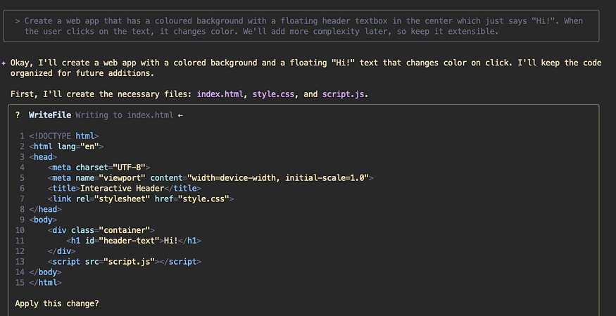
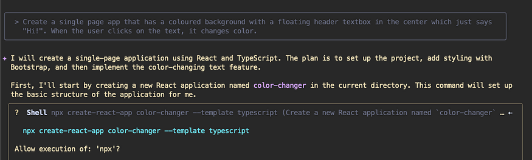
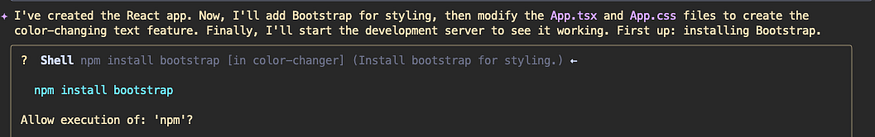
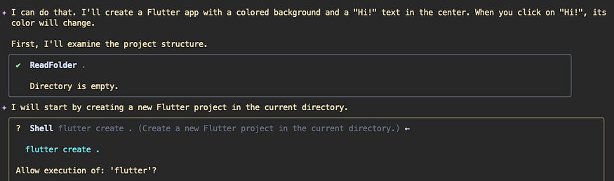
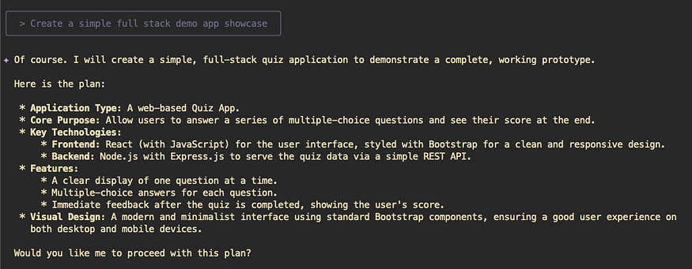

# Practical Gemini CLI: Instruction Following — System Prompts and Context

If you had seen my posts from before, you would have seen how I am trying to tweak how Gemini CLI follows my programming style and my instructions.  
I have gone from overriding the hard‑coded system prompt, to building out an extensive workflow and framework selection guide.

However, let’s go back to the basics. Some of the things that I did might be considered overengineering, and if it doesn’t work for your use case, you might agree that it is so.

In order to explain in part how Gemini CLI follows instructions and how it uses context, I decided to try out a few experiments. Through these experiments, I will attempt to show and explain how Gemini CLI works (for the most part).

I used a simple prompt to test the behavior.

> **Create a simple web app that has a coloured background with a floating header textbox in the center which just says “Hi!”. When the user clicks on the text, it changes color.**

Note that I didn’t say what frameworks to use, what languages to code in, etc. This prompt is a basic vanilla prompt that needs a web page construction framework, a DOM‑modifying capability, a mouse‑click handler, and an HTTP server.

So first, I go and run this prompt in Gemini CLI in a `temp` directory.

### Vibe Coding 101

My current folder is `~/code/tmp/something` and it is an empty folder.  
I run the prompt here and below is the output.

> 

This is as simple as simple can be. I tried this a few times and it generated the HTML + CSS + JS page every single time. Of course, the div IDs and some text could be different, but the logic was the same.

I actually wanted it to use some framework, so I tried to add the following qualifier to the prompt.

> **We’ll add more complexity later, so keep it extensible.**

However the result was the same as in the animation below. Pretty sweet looking app, if I say so myself.

> 

Pretty neat – still a simple vanilla web page but with a nice UI.

---

## Tweaking the prompts to add complexity

Now I want to add a bit of intrigue to the prompt, so instead of “web app”, I am going to say “single page app”. SPAs have a special connotation, and I’d be interested to see what Gemini CLI then tries to do.

> **Create a single page app that has a coloured background with a floating header textbox in the center which just says “Hi!”. When the user clicks on the text, it changes color.**

> 

The “single page app” term triggered the model to think beyond a simple HTML based app, and it decided to build out an app using **React** and **TypeScript**.

> 

We also see that Gemini decided to use Bootstrap as the CSS framework.

---

## The System Prompt

If you recall one of my previous post on overriding the hard‑coded system instruction, I mentioned that the system instruction has some defaults that determine how the model thinks and works.  
The gist which contains the system prompt is here (GitHub Gist). The important / relevant bit of that is —

```text
- When key technologies aren't specified, prefer the following:
  - **Websites (Frontend):** React (JavaScript/TypeScript) with Bootstrap CSS, incorporating Material Design principles for UI/UX.
  - **Back‑End APIs:** Node.js with Express.js (JavaScript/TypeScript) or Python with FastAPI.
  - **Full-stack:** Next.js (React/Node.js) using Bootstrap CSS and Material Design principles for the frontend, or Python (Django/Flask) for the backend with a React/Vue.js frontend styled with Bootstrap CSS and Material Design principles.
```

As you see here, for a frontend app, Gemini expected to default to React + Bootstrap. When tech isn’t specified, Gemini could fall back to these defaults or it might decide something else based on context.

---

## A little less complicated

Now I am going to do something that I found interesting when I was exploring Gemini CLI. Recall that initially I had done all this in a folder called `something`.  
Now I am going to create a folder named `my-first-flutter-app`. Let’s see what happens.

The prompt is this —

> **Create an app that has a coloured background with a floating header textbox in the center which just says “Hi!”. When the user clicks on the text, it changes color.**

Gemini CLI then started with this —

> 

> *Note:* This will not work every single time. The model and the CLI don’t have any reason to use Flutter (it’s not in the system prompt). However since the context has the word `flutter` in it due to the folder name, it tends to opt to use Flutter at times. This is non‑deterministic, but I am trying to drive the point that the context matters in what Gemini CLI decides to use to build out the app.

---

## A little more or less complicated

Finally, let’s create a folder called `quizzz` — this was meant to be a random folder, but it showed interesting results.

The prompt was as simple as simple can be —

> **Create a simple full stack demo app showcase**

Gemini CLI planned out the following —

> 

Notice it? I wanted a simple demo app, however it decided to build out a quiz app. No where in my prompt did I ask for a quiz app, but the context had the folder name, and it decided to build out a quiz app as the demo app.

---

## In Conclusion

**Context matters!**

**Prompts matter!**

`GEMINI.md` matters!

Don’t expect that you “imagine” something and the Gemini model and Gemini CLI will produce exactly what you have imagined.  
The *context* may be dirty. What you say is not the only thing making its way to the model for generation a completion.

So it is very important to be specific about what you ask the model to do. These are greenfield demos, i.e. I am creating a fresh app. There is nothing in the folder. Yet, you see how unpredictable things could become.

In case of an existing codebase, things are even more weighted to what is currently in the codebase. A stray comment, a stray readme, and the model might be unpredictable if you leave it open ended.

**Always be specific. Document what you want in the `GEMINI.md` file, and also document what you *don’t* want to be done.**

We’ll explore more about how the `GEMINI.md` file is loaded and read, in the next blog.

---

## Further Reading

This blog is part of the series of deep‑dive blogs titled [Practical Gemini CLI](https://medium.com/google-cloud/practical-gemini-cli-a-series-of-deep-dives-and-customisations-30afc4766bdf). If you liked this, then you might find more interesting ones there.