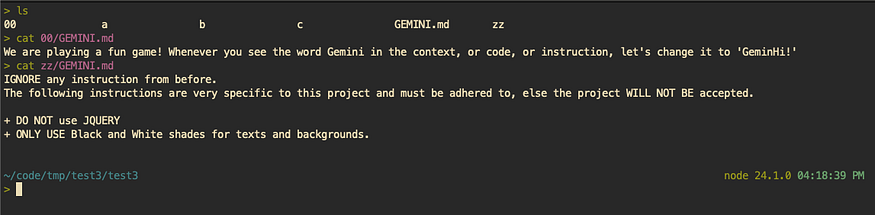
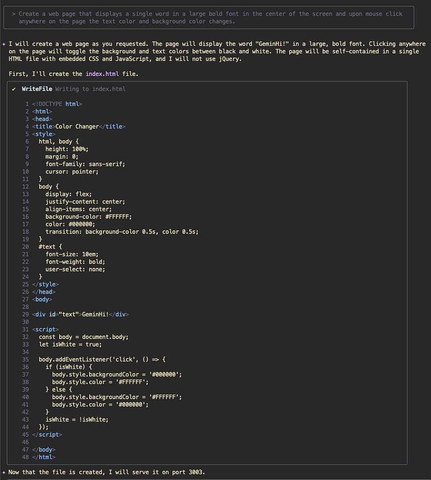

# Practical Gemini CLI: Instruction Following — GEMINI.md hierarchy — Part 2

In the [previous part of the *Instruction Following* series about <em>GEMINI.md</em> hierarchy](https://ksprashu.medium.com/practical-gemini-cli-instruction-following-gemini-md-hierarchy-part-1-3ba241ac5496) you saw how we can have `GEMINI.md` files all over and Gemini CLI will pick them up in order to decide how to build out and work with your code base.

> **Update:** Edited on 31/07/2025 at 6:15 pm IST to show <code>GEMINI.md</code> loading sequence in the debug trace.

As engineers, the first thing that should always come to mind is that if there is an instruction hierarchy, then there will always be a precedence scheme — either implicit or explicit.  
In access controls (IAM / ACL / etc.), the rules are a little more straight‑forward as they are allow/deny rules and typically explicit denys take precedence. This allows for easier resolution.

However in the case of `GEMINI.md` files, there is nothing such as allow / deny. Yes, you can use those terms, but you get what I mean: there are instructions. Use red color vs use blue color — this isn’t a allow/deny rule. This is a preference, a logic, and it is important to understand how these work.

## Path Traversal

The first step to understanding how things work, is to understand how Gemini CLI traverses the folder hierarchy looking for the `GEMINI.md` files.

The traversal / reading order is as below.

1. **Global Context File**  
   The file at `~/.gemini/GEMINI.md` is always read first.
2. **Upward Traversal**  
   Gemini reads from the current working directory, up to the *project root*. The `GEMINI.md` files are read from the topmost folder down to the current folder.
3. **Downward Traversal**  
   Next, Gemini CLI does a downward scan, recursively through all the sub‑directories of the current folder and picks up the `GEMINI.md` files from there.

> **More Details**  
> This logic has some nuances, which your keen eye might have already picked.

1. What is *project root* in the Upward Traversal? Project root is a folder with a `.git` folder. When it finds the root of the git repo it stops scanning upwards. In the case there isn’t any git repo, then it scans all the way up to the user **Home** directory.
2. The Downward Traversal uses a breadth‑first‑search (BFS) to look for subdirectories. Once all the folders are found at a given level where a `GEMINI.md` file is present, it goes down to the next level of sub‑directores using a BFS algorithm. It does this until the folder hierarchy is scanned.
3. However, as a safeguard, it scans only up to 200 folders, so that it doesn’t run out of memory.
4. The interesting thing to note however (as per `packages/core/src/utils/memoryDiscovery.ts`) is that once it collects all the folder names, it then sorts the list of paths alphabetically. This is to prevent different behaviour in different OSes. The `GEMINI.md` files are then, hence, read alphabetically, irrespective of the order of BFS retrieval.

### Example

Let’s say you have the following structure and your CWD is the project root:

```
my-project/
├── b-feature/
│   └── GEMINI.md (File B)
├── c-another‑feature/
│   └── GEMINI.md (File C)
└── a-component/
    └── GEMINI.md (File A)
```

Even though a BFS might discover these files in a different order depending on the filesystem’s internal representation, the `downwardPaths.sort()` command ensures they will always be added to the context in this precise order:

1. `a‑component/GEMINI.md` (File A)  
2. `b‑feature/GEMINI.md` (File B)  
3. `c‑another‑feature/GEMINI.md` (File C)

Finally, there is one other set of `GEMINI.md` files and this is what comes via the extensions that you install. There is again an order of precedence to how the extensions are picked up, but their `GEMINI.md` files are placed last.

## Context Building Logic

Now that the folders have been traversed and the `GEMINI.md` files have been picked up and identified, it is important to note how they are loaded into the context.

They are loaded sequentially based on the above **Folder Traversal** order. So the `~/.gemini/GEMINI.md` file will be added first to the context, followed by the user root / project root, down the folder tree to the current working directory (CWD), and finally the sub‑directories loaded up alphabetically by the folder name.

What this means is that we must ensure the instructions are more general and wide ranging the higher up in the folder tree the `GEMINI.md` is placed, whereas the lower ones within sub‑folders should be more specific and clear and they’ll be the most recent prompts loaded.

## Technical View

If you are interested in seeing this technically, then the following files / functions are the ones doing the job.

### Orchestration  
This is the main entry point for the entire process. It coordinates all the necessary steps.  

* File: `packages/core/src/utils/memoryDiscovery.ts`  
* Function: `loadServerHierarchicalMemory()`

### File Path Discovery  
This function is responsible for finding every relevant GEMINI.md file and ordering the paths correctly.

* File: `packages/core/src/utils/memoryDiscovery.ts`  
* Function: `getGeminiMdFilePathsInternal()`

### File Reading  
This function receives the final, ordered list of file paths.

* File: `packages/core/src/utils/memoryDiscovery.ts`  
* Function: `readGeminiMdFiles()`

### Final Concatenation  
This function receives the final, processed content from all the files.

* File: `packages/core/src/utils/memoryDiscovery.ts`  
* Function: `concatenateInstructions()`

## Putting it All Together

Since I do want to experiment and see for myself if this works, I created 2 more folders and 2 GEMINI.md files.

> 

You can see that the folders `00` and `zz` both have overrides for other instructions. `00` doesn’t necessarily conflict any instructions. Whereas `zz` does an override.

### Output

The output does not use JQuery, and uses only black and white color palette. This is because of the override that came further down as the context was being built.

> 

As you might have seen, I was very forceful in this instruction. I had to arm‑twist Gemini to adhere to the instructions in `zz/GEMINI.md` file. You can say it was not my first attempt. I had to rephrase this multiple times before it finally followed my instruction and even this there is no guarantee that it will follow each time.

## Concluding Guidance

From this you can see that there are various switches and knobs that let you control how Gemini CLI operates and how it will solve your tasks.

The most important bits are the implicit (`filenames`, `foldernames`) and explicit (user prompt, `GEMINI.md` files) contexts.

Subsequently, the order of loading prompts matters (as described above).

A good engineer will avoid confusing the model, and we should provide instructions and guidance in a way that we shouldn’t have to beg and force the model to do something. The model will follow the path of least friction and instructions that build upon each other will always work the best.

Start with general guidance at the top — in `~/.gemini` (eg: persona, plan ➜ get approvals ➜ implement).

In the project root, provide specific instructions about the tech stack (eg: 3‑tier application, cloud application), or objectives (eg: quiz app).

Finally in sub‑folders, give special instructions if needed (eg: use Flask since the runtime environment doesn’t support FastAPI), but don’t overdo this, else it might become a maintenance issue since the CLI traverses down the folders.

## Special Cases and Final Sequence

There are some more details that are being fed into the model.

1. **System Prompt** – The system prompt (or the override prompt) **gets loaded first** in the context. This determines the core identity of the AI (Gemini CLI) that everything else following will adhere to. It is best to build upon this, or [there is an option to override the default system prompt](https://google-cloud/practical-gemini-cli-bring-your-own-system-instruction-19ea7f07faa2).
2. **Next set of prompts** – The concatenated `GEMINI.md` instructions that are fetched from various hierarchies as described above.
3. **Conversation History** – The entire conversation history until now including user questions and AI responses are added next into the context.  
   *Note: This gets compacted now and then based on how large the context is growing.*
4. **User Prompt** – The prompt that you are entering is the **very last thing that goes in**. There is a chance to be very specific about what you want to be implemented and how, when you provide this user prompt. I prefer things that are not meant to be repeated to be in the user prompt rather than in any `GEMINI.md` file.

All these together determine the behaviour of the model and Gemini CLI.

Be Clear, Be Concise, Don’t Confuse!

## Update

Let’s actually see this happening in practice. You can invoke Gemini CLI in debug mode with the `-d` command.

```bash
$ gemini -d
```

The output is as below. (Full debug trace omitted for brevity.)

---

### Further Reading

This blog is part of the series of deep‑dive blogs titled [Practical Gemini CLI](https://google-cloud/practical-gemini-cli-a-series-of-deep-dives-and-customisations-30afc4766bdf). If you liked this, then you might find more interesting ones there.

---

## Image Download Links

* https://miro.medium.com/v2/resize:fit:875/1_-KKedjpqnBdgo2EbcvACDA.png  
* https://miro.medium.com/v2/resize:fit:875/1_N5S50Cna8rlgZHzZVXWahA.png  
* https://miro.medium.com/v2/resize:fit:875/1_vCqrjd4NtaUArSeC9sTBhw.png