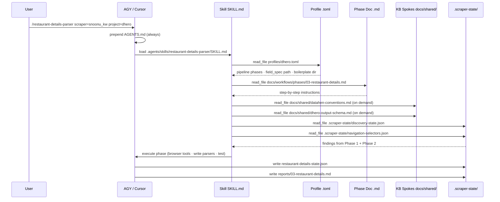

# Knowledge Structure & Context Architecture

This document is the authoritative map of the system — what exists, where it lives,
how an AI agent loads context, and how knowledge is prioritized when layers conflict.

---

## 1. Knowledge Pyramid — Priority Order

Higher layers **constrain** lower ones. When layers conflict, the higher layer wins.
The agent loads from bottom up: firmware is always present; everything else is loaded on demand.

```mermaid
graph TD
    subgraph L8["🔴 Runtime State  (most specific — current scraper)"]
        RS1[".scraper-state/discovery-state.json\nWhat was found in Phase 1"]
        RS2[".scraper-state/*-state.json\nFindings from each phase"]
        RS3[".scraper-state/phase-status.json\nWhich phases are done"]
        RS4[".scraper-state/reports/<phase>.md\nPhase audit reports"]
    end

    subgraph L7["🟠 Project Specification  (this project type)"]
        PS1["profiles/dhero.toml\nPipeline phases · template dir · QA config"]
        PS2["profiles/dmart-dloc.toml"]
        PS3["dhero-field-spec.json\n2 collections (locations + items) · 50 fields"]
        PS4["field-spec.json\nproducts collection · 49 fields"]
    end

    subgraph L6["🟡 Project Output Schema  (what to extract + format)"]
        OS1["docs/shared/dhero-output-schema.md\nlocations 28 fields · items 22 fields · wiring"]
        OS2["docs/shared/output-hash-rules.md\ndmart/greenfield 53 fields · nil-explicit rule"]
    end

    subgraph L5["🟢 Phase Workflow Docs  (how to execute each phase)"]
        PH1["docs/workflows/phases/01-site-discovery.md"]
        PH2["docs/workflows/phases/02-navigation-parser.md"]
        PH3["docs/workflows/phases/03-restaurant-details.md  ← dhero"]
        PH4["docs/workflows/phases/03-details-parser.md      ← dmart"]
        PH5["docs/workflows/phases/04-menu-listings.md       ← dhero"]
        PH6["docs/workflows/phases/05-menu-details.md        ← dhero"]
        PH7["docs/workflows/phases/api-0*.md                 ← API pipeline"]
    end

    subgraph L4["🔵 DataHen Conventions & Best Practices"]
        DH1["docs/shared/datahen-conventions.md\nParser top-level · GID · save_* · _log schema"]
        DH2["docs/shared/datahen-ruby-parsers.md\nGems · rescue patterns · pagination · dedup"]
        DH3["docs/shared/agent-best-practices.md\n10 production principles"]
        DH4["docs/shared/phase-report-spec.md\nPhase audit format"]
    end

    subgraph L3["🔵 General Scraping Patterns"]
        SP1["docs/shared/selector-discovery.md\ngrep → inspect → verify order"]
        SP2["docs/shared/browser-mcp-tools.md\nTool reference + cost protocol"]
        SP3["docs/shared/playwright-refs.md\nRefs vs CSS — never use ref in Ruby"]
        SP4["docs/shared/pagination-network-exhaustion.md\nMandatory 3-probe sequence"]
        SP5["docs/shared/parser-testing.md\nparser_tester usage · 3-sample rule"]
    end

    subgraph L2["⚪ Persona & Strategy  (always loaded)"]
        PER["AGENTS.md\nE-commerce engineer persona · PARSE methodology\nBrowser-first analysis · Overlay handling"]
    end

    subgraph L1["🔴 Firmware  (always loaded — non-negotiable)"]
        FW1["docs/shared/agent-rules-gemini.md\nError taxonomy · popup sequence · _log · auto-chain"]
        FW2[".cursor/rules/firmware.mdc\nCursor-specific: absolute paths · scratch dirs · tool names"]
    end

    L8 --> L7 --> L6 --> L5 --> L4 --> L3 --> L2 --> L1
```



**Priority rule:** A finding in `.scraper-state/` (runtime) overrides a general pattern from `docs/shared/`.
A firmware rule (`agent-rules-gemini.md`) cannot be overridden by any lower layer.

---

## 2. How a Skill Invocation Loads Context

A slash command (e.g. `/restaurant-details-parser scraper=snoonu_kw project=dhero`) triggers this load chain:



**What the skill itself does NOT contain:** The phase instructions. The skill is only a loader.
The actual step-by-step is in the phase doc. Skills are thin; phase docs are thick.

---

## 3. Full System Map — Both Pipelines

```mermaid
graph LR
    subgraph ENTRY["Entry Points"]
        CLI["User types /command\nin AGY or Cursor"]
    end

    subgraph SKILLS["Skills layer\n.agents/skills/*/SKILL.md"]
        S1["/scrape"]
        S2["/navigation-parser"]
        S3["/restaurant-details-parser\ndhero"]
        S4["/details-parser\ndmart · greenfield"]
        S5["/menu-listings-parser\ndhero"]
        S6["/menu-parser\ndhero"]
        S7["/qa"]
        S8["/run-pipeline"]
        S9["/export-chat"]
    end

    subgraph PROFILES["Project Config\nprofiles/"]
        P1["dhero.toml\n5 phases · dhero-field-spec.json"]
        P2["dmart-dloc.toml\n3 phases · field-spec.json"]
        P3["greenfield.toml\n3 phases · message-driven"]
    end

    subgraph PHASES["Phase Docs\ndocs/workflows/phases/"]
        PH1["01-site-discovery"]
        PH2["02-navigation-parser"]
        PH3A["03-restaurant-details\ndhero"]
        PH3B["03-details-parser\ndmart"]
        PH4["04-menu-listings\ndhero"]
        PH5["05-menu-details\ndhero"]
        API["api-01/02/03\ndmart API"]
    end

    subgraph SHARED["Shared Knowledge\ndocs/shared/"]
        KB["KB_HUB.md\n(index)"]
        DH["DataHen spokes"]
        SCRP["Scraping pattern spokes"]
        OUT["Output schema spokes"]
    end

    subgraph BOILERPLATE["Boilerplate Templates\ntemplates/"]
        B1["dhero_boilerplate/\nseeder · lib/ · parsers × 4\nfinisher · input/geo.csv"]
        B2["dmart_dloc_boilerplate/\nseeder · lib/ · parsers × 4\nfinisher"]
        B3["greenfield_boilerplate/\nseeder · lib/ · parsers × 4\nfinisher"]
    end

    subgraph SCRAPER["Generated Scraper\ngenerated_scraper/<name>/"]
        GEN["parsers/ · seeder/ · lib/\nconfig.yaml · README.md"]
        STATE[".scraper-state/\nJSON state files\nreports/*.md"]
        QA["GENERATION_REPORT.md\ndeploy-readiness.json\nspec.csv"]
    end

    CLI --> SKILLS
    SKILLS --> PROFILES
    PROFILES --> PHASES
    PHASES --> SHARED
    SHARED --> SCRAPER
    BOILERPLATE -.->|"Phase 1 copies template"| SCRAPER
    SKILLS -->|"/qa reads"| SCRAPER
```



---

## 4. dmart vs dhero — Structure Comparison

### Pipeline shape

| | **dmart / greenfield** | **dhero** |
|---|---|---|
| Phase count | 3 (HTML) or 3 (API) | 5 |
| Data model | `products` (49 fields) | `locations` (28) + `items` (22) |
| Seeding | URL from spec/message | Geo discovery (API or HTML) |
| Phase 1 | site-discovery (shared) | site-discovery (shared) |
| Phase 2 | navigation-parser (shared) | navigation-parser (shared) |
| Phase 3 | details-parser | restaurant-details-parser |
| Phase 4 | — | menu-listings-parser |
| Phase 5 | — | menu-parser |
| Field spec | `field-spec.json` (repo root) | `dhero-field-spec.json` (repo root) |
| Output schema doc | `output-hash-rules.md` | `dhero-output-schema.md` |

### Boilerplate `lib/` comparison

| File | dhero | dmart | greenfield |
|---|---|---|---|
| `headers.rb` | ✅ | ✅ | ✅ |
| `helpers.rb` | ✅ | ✅ | ✅ |
| `extraction.rb` | ✅ | ❌ | ❌ |
| `site_config.rb` | ✅ | ❌ | ❌ |
| `regex.rb` | ❌ | ✅ | ❌ |

**Gap:** dhero has a proper extraction abstraction (`extraction.rb`); dmart/greenfield do not.
Both have `helpers.rb` but the contents differ. No shared `lib/` is guaranteed between them.

### What is already consistent

- Same profile TOML schema (`[project]`, `[template]`, `[boilerplate]`, `[qa]`, `[[pipeline.phases]]`)
- Same `[qa]` block wired to same `/qa` skill + `scraper_qa_report.rb`
- Same CI gate (`scripts/ci-check.sh`) covers both
- Same phase report format (`.scraper-state/reports/`)
- Same deploy artifact set (`GENERATION_REPORT.md`, `deploy-readiness.json`, `spec.csv`, `README.md`)
- Same skill invocation pattern for shared phases (Phase 1, Phase 2)

### Standardization gaps

| Gap | Current state | Suggested fix |
|---|---|---|
| Output schema doc naming | `output-hash-rules.md` (dmart) vs `dhero-output-schema.md` | Rename to `dmart-output-schema.md` for symmetry |
| `lib/extraction.rb` | dhero only | Add equivalent to dmart boilerplate (JSON-LD + meta extraction helpers) |
| `lib/site_config.rb` | dhero only | dmart equivalent: API base URL + fetch headers config |
| `input/geo.csv` | dhero only (geography seeding) | Keep dhero-only — genuinely different seeding model |
| Phase doc naming | `03-restaurant-details.md` vs `03-details-parser.md` | Consistent — `03-` prefix on both is fine |
| Knowledge-structure.md | References old `spec_full.json` (wrong) | Fixed in this revision |

---

## 5. Where New Knowledge Goes — Decision Table

| Type of knowledge | Goes in | Notes |
|---|---|---|
| Parser must be top-level, no `def parse` | `docs/shared/datahen-conventions.md` | DataHen V3 system fact |
| Pre-loaded gem (e.g. `nokogiri`) | `docs/shared/datahen-ruby-parsers.md` | DataHen V3 system fact |
| "Always grep before inspect" | `docs/shared/selector-discovery.md` | General scraping pattern |
| New MCP tool | `docs/shared/browser-mcp-tools.md` | General scraping pattern |
| "Field X must be nil, not omitted" | `docs/shared/output-hash-rules.md` (dmart) or `docs/shared/dhero-output-schema.md` | Output schema |
| New phase step (all projects) | `docs/workflows/phases/<phase>.md` | Phase workflow |
| New phase step (dhero only) | `docs/workflows/phases/03-restaurant-details.md` or `04-*.md` | Phase workflow |
| New client field | `dhero-field-spec.json` or `field-spec.json` | Project spec |
| New pipeline phase or project type | `profiles/<project>.toml` | Project config |
| Why we decided X | `docs/proposals/YYYY-MM-DD-<slug>.md` | Decision record |
| Claude-only cross-session fact | `memory/*.md` | Claude memory |

---

## 6. What Each Agent Actually Reads

### Antigravity CLI / Cursor (scraping agent)

```
Session start:
  AGENTS.md                          ← always (persona + operational rules)

On skill invocation /scrape:
  .agents/skills/scrape/SKILL.md     ← command loader
  profiles/<project>.toml            ← pipeline + spec paths
  docs/workflows/phases/01-*.md      ← phase instructions

On demand (read_file by skill or phase doc):
  docs/shared/agent-rules-gemini.md  ← firmware
  docs/shared/datahen-conventions.md ← parser rules
  docs/shared/KB_HUB.md → spokes    ← topic-specific knowledge
  dhero-field-spec.json              ← what to extract

At runtime:
  generated_scraper/<name>/.scraper-state/*.json  ← prior phase findings
```

### Claude Code (this agent — planning + maintenance)

```
Session start:
  CLAUDE.md                          ← mandatory rules (overrides defaults)
  memory/MEMORY.md                   ← persistent project context

On demand:
  docs/knowledge-structure.md (this file)
  docs/shared/*.md                   ← same spokes as AGY
  docs/proposals/*.md                ← decision context
```

Both agents share `docs/shared/` as neutral ground.
`CLAUDE.md` and `AGENTS.md` are agent-specific and not read by the other.
